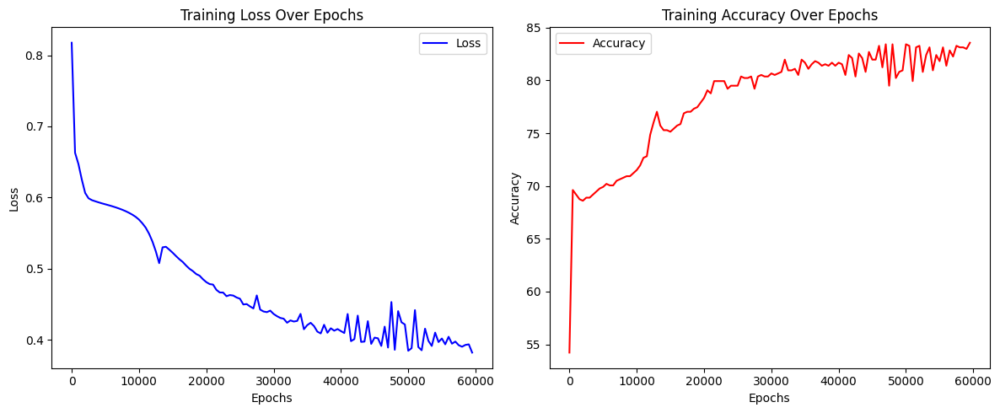
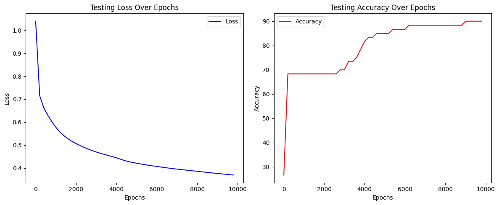

# Classification

A classification algorithm in machine learning is used to categorize data into predefined classes or labels. It learns from training data with known class labels and makes predictions on new, unseen data based on learned patterns. Examples include logistic regression, decision trees, support vector machines, and neural networks. These algorithms output a class label, such as 'spam' or 'not spam,' based on the input features  

## Dataset

1. [Kaggle] Heart Failure:  
<https://www.kaggle.com/datasets/fedesoriano/heart-failure-prediction>
2. [UC Irvine] Heart Failure:  
<https://archive.ics.uci.edu/dataset/519/heart+failure+clinical+records>

## Table of Content

- [Plotting Sigmoid Function](./sigmoid-function.ipynb)
- [Binary Classify Heart Failure - 8 features - Kaggle Dataset](./classify-heart-failure.ipynb)⭐

- [Binary Classify Heart Failure - 3 features - Kaggle Dataset](./classify-heart-failure-2.ipynb)
- [Binary Classify Heart Failure - 7 features - UCI Dataset](./class-heart-failure-ds-2.ipynb) ⭐

